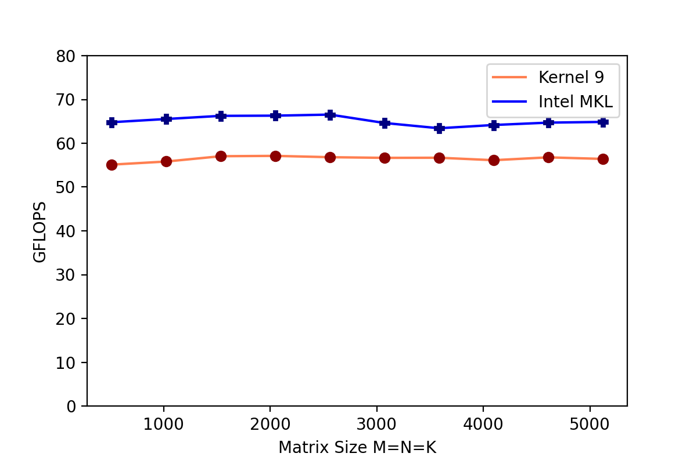

## Optimize DGEMM on Intel CPU

This repo contains several implementations of DGEMM on CPU. I tried different optimization techniques, such as tiling, register blocking, AVX2, AVX512, cache blocking and packing. The best implementation is `header_file/kernel9.h`, which achieves >85% performance of Intel MKL. 

### Test Environment
System: Ubuntu20.04 under WSL2

Compiler: GCC 9.3.0

Intel MKL: 2022.02

Required compile flag: -std=c++11 -march=native -O2 

To use AVX512, the system needs to support AVX 512. It can be checked in terminal using the command: `lscpu` 

### Results

## Reference

1: https://github.com/flame/how-to-optimize-gemm

2: https://github.com/yzhaiustc/Optimizing-DGEMM-on-Intel-CPUs-with-AVX512F